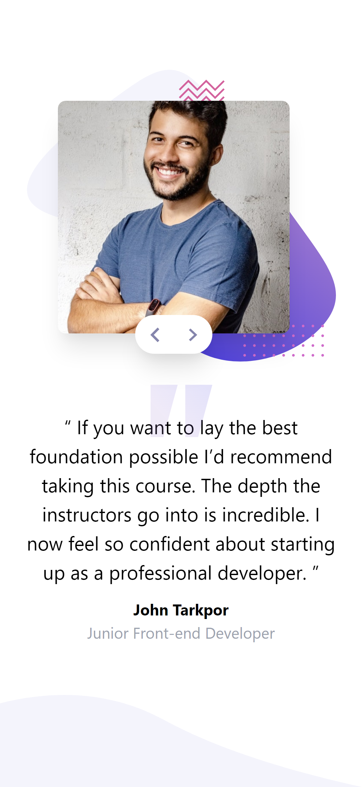
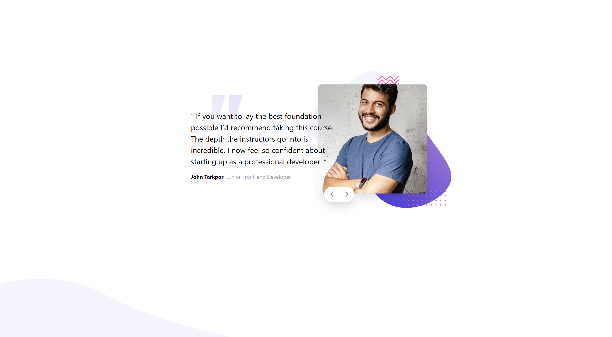

# Frontend Mentor - Coding bootcamp testimonials slider solution

This is a solution to the [Coding bootcamp testimonials slider challenge on Frontend Mentor](https://www.frontendmentor.io/challenges/coding-bootcamp-testimonials-slider-4FNyLA8JL). Frontend Mentor challenges help you improve your coding skills by building realistic projects.

## Table of contents

- [Overview](#overview)
  - [The challenge](#the-challenge)
  - [Screenshot](#screenshot)
  - [Links](#links)
- [My process](#my-process)
  - [Built with](#built-with)
  - [Continued development](#continued-development)
  - [Useful resources](#useful-resources)
- [Author](#author)

## Overview

### The challenge

Users should be able to:

- View the optimal layout for the component depending on their device's screen size
- Navigate the slider using either their mouse/trackpad or keyboard

### Screenshot

#### Tanya

> Mobile Design
> 
> Desktop Design
> 

#### John

> Mobile Design
> 
> Desktop Design
> 

### Links

- Solution URL: [Add solution URL here](https://your-solution-url.com)
- Live Site URL: [Add live site URL here](https://your-live-site-url.com)

## My process

### Built with

- Semantic HTML5 markup
- [Tailwind](https://tailwindcss.com/)
- Javascript
- Mobile-first workflow

### Continued development

Every project I develop is the best way to test my skills and grow ad a dev. I highly recommend these projects.

### Useful resources

- [Tailwind/docs](https://tailwindcss.com/docs) - This is the official documentation of tailwindcss

## Author

- Github User - [Lenugo](https://www.github.com/Lenugo)
- Frontend Mentor User - [Lenugo](https://www.frontendmentor.io/profile/Lenugo)
